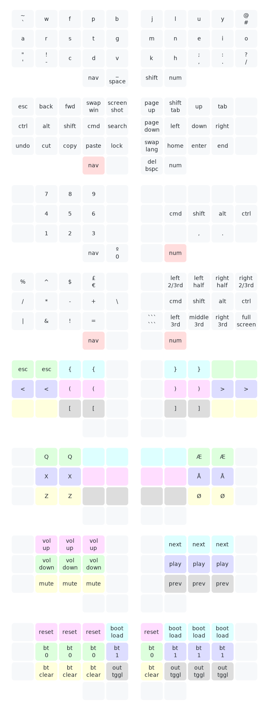

# Configuration for my QMK keyboards

## Setup

* It is assumed that [`qmk_firmware/`](https://github.com/qmk/qmk_firmware) is located in `../` (so, same directory as this repo).
* Run the script [`setup.sh`](setup.sh) in order to symlink this directory into qmk.

## Introduction

My layout is based on having just 34 keys. I might use keyboards larger than this, but not smaller. It is a form factor which is simple, effective and intuitive. I use various keyboards and hence my keyboards layouts are created in the users folder and then shared among several other keyboards.

For the actual keymap, I recommend reading through the keymap shown below. For how that keymap is then mapped to each keyboard I use, read through the config files of each keyboard listed below. Every config file contains a define which basically maps my layout to that particular keyboard. The `keymap.c` file itself is empty.
This approach ensures that it is quite easy to add support for a new keyboard PCB as long as it fits the 34-key layout. All you have to do is write the *adapter configuration*.

Right now I have support for the following keyboards, with the Sweep being the primary:

* [*Ferris Sweep*](https://github.com/davidphilipbarr/Sweep) ([`config.h`](keyboards/ferris/keymaps/metheon/config.h)):
  * `make ferris/sweep:metheon:flash` or `:dfu-split-left`
  * `make ferris/sweep:metheon:flash` or `:dfu-split-right`
* [*Kyria*](https://splitkb.com) ([`config.h`](keyboards/splitkb/kyria/keymaps/metheon/config.h)):
  * `make splitkb/kyria:metheon:flash`
* [*Planck EZ*](https://ergodox-ez.com/pages/planck) ([`config.h`](keyboards/planck/keymaps/metheon/config.h)):
  * `make planck/ez:metheon:flash`

In the following sections I will dive into different aspects of my keymap.

### Special thanks

Just a big shoutout to the communities on the following discords: SplitKB, Colemak, Hands Down, ZMK and QMK.

## Layout

I have mainly been a [Colemak](https://colemak.com/) user, but eventually decided to switch as does not work too well with Danish which is my native language. I tried out [Hands Down Gold](https://sites.google.com/alanreiser.com/handsdown/home) briefly, but did not like the `R` on pinky. Alan (creator of Hands Down) then made a new version called Titanium with `R` on thumb. After using that a bit I decided to make my own layout which took the best parts of Colemak and Hands Down Titanium. Thus my own layout was born called `methane`. The chemical formular for `methane` is `CH₄` which is homage to the one part Colemak and the four part Hands Down that served as inspiration for the layout. It has around `1%` SFBs against a mixed corpus of Danish and English.

## Process Records

My process records files are also pretty basic. The main purpose of splitting this into their own files is simply readability.

Files:

* [`process_records.c`](users/metheon/process_records.c)
* [`process_records.h`](users/metheon/process_records.h)

## Key Overrides

Just a list of key+mod overrides which aims to improve the shifted character of base layer symbols.

Files:

* [`key_overrides.def`](users/metheon/key_overrides.def)
* [`key_overrides.c`](users/metheon/key_overrides.c)

## Keymap

